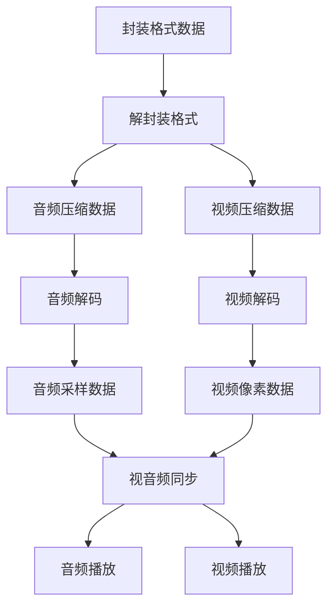

[toc]

# 一、引言

* 目的
  
  * 整合FFmpeg的函数，利用QT实现一个简单的播放器
  
* 内容
  
  * 实现"H.264$\rightarrow$YUV$\rightarrow$电脑屏幕"
  
* 封装格式（MP4，RMVB，TS，FLV，ASF、AVI，MKV）

  <table>
      <tr>
          <td>封装格式（格式头）</td>
          <td>视频编码帧</td>
          <td>音频编码帧</td>
          <td>视频编码帧</td>
          <td>视频编码帧</td>
          <td>音频编码帧</td>
          <td>...</td>
      </tr>
  </table>

* MPEG-TS格式简介
  
  * 不包含头文件。数据大小固定（1888Byte）的TS Packet构成(文件损坏依旧可以播放)
  
    <table>
        <tr>
            <td>...</td>
            <td>TS Packet</td>
            <td>TS Packet</td>
            <td>TS Packet</td>
            <td>TS Packet</td>
            <td>TS Packet</td>
            <td>...</td>
        </tr>
    </table>

* FLV格式简介
  
  * 包含文件头。数据由大小不固定的Tag构成(文件头丢失，整个文件不可播放)
  
    <table>
        <tr>
            <td bgcolor="gray">FLV Header</td>
            <td>Tag(metadata)</td>
            <td>Tag(video)</td>
            <td>Tag(audio)</td>
            <td>Tag(video)</td>
            <td>...</td>
        </tr>
    </table>

* 视频编码数据（H.264[最常用]，MPEG2，VC-1，wmv，XviD，mjpeg）(基本都是有损压缩)
  * 视频编码的作用就是将视频像素数据压缩成为视频码流，从而降低视频的数据量
  * H.264简介
    * 数据有大小不固定的NALU构成
    
    * 最常见的情况：1个NALU存储了1帧画面压缩编码后的数据。
    
    * 其压缩方式比较复杂，可以将图像数据压缩100倍以上
    
      <table>
          <tr>
              <td>...</td>
              <td>NALU</td>
              <td>NALU</td>
              <td>NALU</td>
              <td>NALU</td>
              <td>NALU</td>
              <td>...</td>
          </tr>
      </table>

* 音频编码数据（(AAC[最常用]，MP3)有损压缩，AC-3，ape(无损压缩)，flac）
  * AAC简介
    * 数据由大小不固定的ADTS构成
    
    * 其压缩数据表较复杂，可以将音频数据压缩10倍以上
    
      <table>
          <tr>
              <td>...</td>
              <td>ADTS Pkt</td>
              <td>ADTS Pkt</td>
              <td>ADTS Pkt</td>
              <td>ADTS Pkt</td>
              <td>ADTS Pkt</td>
              <td>...</td>
          </tr>
      </table>

* 视频像素数据（YUV420P[最常用]，RGB）
  * 保存了屏幕上每个像素点的像素值。
  
  * 视频像素数据体积很大
  
  * RGB24分别记录每个像素点R(Red)、G(Green)、B(Blue)信息（BMP文件存储的就是RGB格式的像素数据）
  
  * YUV将亮度信息(Y)和色度信息(UV)分离
  
    $R=Y+1.4075\times(V-128)$
  
    $G=Y-0.3455\times(U-128)-0.7169\times(V-128)$
  
    $B=Y+1.779\times(u-128)$
  
* 音频采样数据（PCM）
  * 保存了音频中每个采样点的值。
  * 体积很大，常用采样率达44100Hz，采样精度一般为16Bit和32Bit
  * PCM简介
    * 单声道顺序存储每个采样点数据
    
    * 双声道的情况下按照“左右、左右”的顺序存储每个采样点两个声道的数据
    
      <table>
          <tr>
              <td>L</td>
              <td>R</td>
              <td>L</td>
              <td>R</td>
              <td>L</td>
              <td>...</td>
          </tr>
      </table>
# 二、视频播放器

## 1. 原理

## 2. 工具

* 常用播放器
  * 跨平台系列（非DirectShow框架）
    * VLC，Mplayer，ffplay……
  * WIndows系列（DirectShow）
    * 完美解码，终极解码，暴风影音……
* 信息查看工具
  * 综合信息查看
    * **MediaInfo**
  * 二进制信息查看 
    * UltraEdiit（不太涉及）
  * 单项详细分析
    * 封装格式：**Elecard Format Analyzer**
    * 视频编码数据：Elecard Stream Eye
    * 视频像素数据：YUV Player
    * 音频采样数据：Adobe Audition
## 3.视频解码
* 解码流程
  * 纯净的视频解码流程
    * 压缩编码数据$\longrightarrow$像素数据。
    * 解码H.264，就是“H.264$\longrightarrow$YUV”
  * 一般的视频解码流程
    * 一般视频都为封装格式，其中通常还包含音频码流等内容。
    * 需要先提取视频码流，然后解码
    * 例如解码MP4，就是“MP4$\longrightarrow$H.264码流$\longrightarrow$YUV”

# 三、准备

## 下载及安装相关

ffmpeg:
网址：ffmpeg.org
Download——左下选择windows图标——Windows builds by Zeranoe——选4.2.2——64位——下载Shared和Dev

ffmpeg配置
新建一个文件夹，里边手动添加四个文件夹，分别为bin、include、lib、src，项目文件直接放在src中，ffmpeg_Shared中bin文件下的所有文件放于bin中，ffmpeg_Dev中include文件中所有文件放于include中，lib同理

Qt:
网址：download.qt.io
archive/——qt/——5.9/——5.9.0/（我用的是5.9.0，但5.9应该都差不多，下最新的5.9.9应该也可以）—— qt-opensource-windows-x86-5.9.0.exe

* pdb文件也在该目录下
* qtcreator版本为4.3.0

安装——组件中必选msvc2015 64-bit,源码Sources可安可不安,Tools中默认勾选Qt Creator即可，如需用qt的gdb进行调试需自行勾选MinGW

* 尽量不要全部勾选，qt5.9.0在全部勾选好像安装时会有些东西安装失败，貌似是Qt5.9最下方有关qt的组件方面的问题

qt——vs插件：
网站相同archive/——vsaddin/(我用的是2.2.2版本，在网盘中可以找到，最新版里也还有可以支持2015的版本，不知有何区别)

qt环境变量配置：
1.在系统环境变量中添加名为QTDIR的变量，其值位编译器地址，如xxxx\msvc2015_64
2.然后再系统变量中Path添加编译器bin目录(uic.exe所处位置)，如xxxx\msvc2015_64\bin
3.在命令符窗口中用uic -version命令查看是否配置成功

调试工具——win10sdk,
网址： https://developer.microsoft.com/en-us/windows/downloads/windows-10-sdk 
选择镜像或者安装文件都可，我上传的是镜像文件，前面全部默认即可，在控件选择上只留Debugging Tools for Windows即可

## 基础准备

1. Visual Studio 2015
2. Win10SDK安装Debugging tools for windows（调试工具）
3. Qt5.9对应VS安装
4. 安装VS的qt插件
5. 配置Qtcreator（先安装Win10SDK再安装Qtcreator应该会自动搜寻，既不用配置）
   * 工具——选项——Debuggers配置64位和32位的cdb，默认位于C:\Program Files (x86)Windows Kits\10\Debuggers\x64(或x86)\cdb.exe
6. VS中选择Qt项中的Qt options配置相应环境只需要选中Qt\5.9下的msvc2015_64即可，32位添加msvc2515
7. VS创建完项目，为了引入自备的库以及方便管理和挪动，添加相对路径并固定
   * 右键项目——属性
   * 常规——输出目录改为——..\\..\bin
   * 调试——工作目录改为——..\\..\bin
   * C/C++——附加包含目录中添加——..\\..\include
   * 链接器——附加库目录添加——..\\..\lib
   * 链接器——输入——加入需要引用的库
   * 链接器——系统——选择子系统——控制台（打开控制台便于查错）
8. VS的Qt项目转换为Qtcreator项目后编译项目可能会出现dependent 'GeneratedFiles\\moc_vsqt.cpp' does not exist的错误，这是由于Qt没有识别$ (ConfigurationName) 这个宏
   * VS——Qt VS Tools——Qt project settings——properties——MocDirectory——将 $(ConfigurationName)改为Debug
   * 已经用Qtcreator打开的项目需要先关闭重新生成pro文件，外部修改选择全是，再次打开pro文件
   * 构建——清理项目——执行qmake——重新编译

## 将VS的Qt项目转换为Qtcreator项目

* 选择Qt VS Tools——Convert Project to Qt VS Tools Project
* 原本灰色的4个选项全部点亮
* 选择Create Basic .pro File(pri文件会保存所有公用信息，便于跨平台开发，可以勾选)

## 其他相关

1. 图标无法显示
   * 项目转移后，可能会出现图标路径无法找到的情况，用qt creator打开pro文件，在Resources——MYPlay.qrc——/MYPlay——image中查看资源是否存在，如不存在手动将所有图标加载其中，右键添加现有文件于image文件夹中
   * 如果图标还是不能正常显示，打开ui文件查看对应按钮是否有图标，此处注意所有按钮都去除了背景，直接在界面上是看不见的，如有需要，先选中对应按钮对象查看属性，翻到最下面，把flat项勾掉即可显示，如此时还是无图标，须在属性上方icon项中选择对应图标，最后记得把flat项在勾上
   * 如果在运行程序时图标仍未显示，用记事本打开MYPlay.rc，翻到下方将图标路径一一重新设置（应该是不需要的）
2. 如果是重新加载资源或加载新资源建议在qt creator中进行，在vs中进行有时候无法识别路径
3. 新建项目时注意选择库上要选择OpenGL，OpenGL扩展，还有mutilplay
4. 控件相关：
   * goback——后退按钮，槽函数：GoBack()、归属为Clicked
   * goon——前进按钮，槽函数：GoOn()、归属为Clicked
   * isPlay——播放按钮，槽函数：PlayOrPause()、归属为Clicked
   * openFile——打开文件按钮，槽函数：OpenFile()、归属为Clicked
   * playPos——进度条，槽函数：SliderPress()、归属为sliderpress，SliderRelease()、归属为sliderrelease，为了实现点击任意位置，滑动条进行跳转，重载了mousePressEvent函数
   * hover——用于实现鼠标悬浮才显示，功能暂未实现，可不管

# 四、FFmpeg

* 特点
  * 基于命令行（cmd）
    
    * 界面不人性化，操作复杂，很灵活
  * 开源
  
## 1. FFmpeg命令行工具获取

* 下载地址
  * 访问FFmpeg官网（<http://ffmpeg.org>）$\rightarrow$ 选择Download $\rightarrow$ 选择Windows Package $\rightarrow$ 进入Zeranoe FFmpeg网站。
  * 注意不要直接从FFmpeg官网下载源代码。
* 版本说明
  * Zeranoe网站中的FFmpeg分为3个版本：
    * Static：只包含3个体积很大的exe文件。
    * Shared：除了3个体积较小的exe文件外，还包含了dll动态库文件。
    * Dev：只包含了开发用的头文件（\*.h）和导入库文件（\*.lib）。
  * 一般使用命令行时下载Static或者Shared版本就可以了

## 2. 基本的DOS命令

  * 最关键命令
    * 打开指定文件夹命令cd {文件路径}
      * 切换到上一级文件夹cd ..
      * 切换到当前目录下名为xxx的文件夹 cd xxx
    * 改变当前盘符命令,如：c:
  * 其他命令
    * 查看目录内容命令 dir
    * 创建目录命令 md
    * 文件复制命令 copy
    * 删除文件命令 del
    * 清除屏幕命令 cls
* Windows系统提供的额外命令

  * 例如ping，ipconfig等

## 3.ffmpeg.exe的使用

* 命令格式

  * 功能

    ffmpeg.exe用于视频的转码。

  * 最简单的命令

    ffmpeg -i  input.avi  -b:v  640k  output.ts

    该命令将当前文件夹下的input.avi转换为ouput.ts文件，并将其文件视频的码率设置为640kbps。

  * 命令格式

    ffmpeg -i  {输入文件路径}  -b:v  {输出视频码率}  {输出文件路径}

  * 命令参数

    |     参数     |                说明                |
    | :----------: | :--------------------------------: |
    |      -h      |                帮助                |
    | -i filename  |              输入文件              |
    | -t duration  |    设置处理时间，格式为hh:mm:ss    |
    | -ss position |    设置起始时间，格式为hh:mm:ss    |
    | -b:v bitrate |            设置视频码率            |
    | -b:a bitrate |            设置音频码率            |
    |    -r fps    |              设置帧率              |
    |    -s wxh    | 设置分辨率，格式为WxH（用*也可以） |
    |  -c:v codec  |           设置视频编码器           |
    |  -c:a codec  |           设置音频编码器           |
    |   -ar freq   |           设置音频采样率           |

    如：ffmpeg -i video.mkv video.mp4           将video从MKV格式转码为MP4格式并另外保存

## 4.ffplay.exe的使用

* 命令格式

  * 功能

    * 用于视频的播放。

  * 最简单的命令

    ffplay input.avi

    该命令将播放当前文件夹下的input.avi文件。

  * 命令格式

    ffplay {输入文件路径}

    |    快捷键    |      说明      |
    | :----------: | :------------: |
    |    q,ESC     |      退出      |
    |      f       |      全屏      |
    |   p，空格    |      暂停      |
    | 鼠标右键屏幕 | 跳转到指定位置 |

### 5.解封装

* av+register_all()：注册所有组件
* avformat_network_init()
* avformat_open_input(...)：打开输入视频文件
  * 确保av_register_all、avformat_network_init已经停用
  * AVFormatContext **ps
  * const char *url
  * AVInputFormat *fmt
  * AVDictionary **options
* avformat_find_stream_info(...)：获取视频文件信息
* avcodec_find_decoder()：查找解码器
* avcodec_open2()：打开解码器
* av_find_best_stream(...)
* AVFormatContext（封装格式上下文结构体，也是统领全局的结构体，保存了视频文件封装格式相关信息）
  * AVIOContext *pd;char filename[1024];
  * iformat                               //输入视频的AVInputFormat
  * unsigned int nb_streams;             //输入视频的AVStream
  * AVStream **streams;                 //输入视频的AVStream []数组
  * int64_t duration;         //AV_TIME_BASE   输入视频的时长（以微秒为单位）
  * int64_t bit_rate;                                  //输入视频码率
  * void avformat_close_input(AVFormatContext **s);   //关闭输入视频文件，释放空间
* AVInputFormat（每种封装格式（例如FLV，MKV，MP4，AVI）对应一个结构体）
  * name：封装格式名称
  * long_name：封装格式的长名称
  * extensions：封装格式的扩展名
  * id：封装格式ID
  * 一些封装格式处理的接口函数

* AVStream（视频文件中每个视频（音频）流对应一个结构体）
  * AVCodecContext *codec;//过时了
  * id                   //序号
  * AVRational time_base;  //分数表示，减少精度损失
  * int64_t duration;            //毫秒  duration *(time_base.num/(double)time_base.den )*1000 毫秒
  * int64_t nb_frames;
  * AVRational avg_frame_rate;
  * AVCodecParameters *codecpar;（音视频参数）用于替代过时的1
    * enum AVMediaType codec_type;
    * enum AVCodecID codec_id;
    * unint32_t codec_tag;
    * int format;
    * int width;int height;
    * uint64_t channel_layout;int channels; int sample_rate;int frame_size;
* AVPacket （存储一帧压缩编码数据）
  * AVBufferRef *buff;    //删除的时候-1
  * int64_t pts;              //pts * (num/den)  显示时间戳
  * int64_t dts;             //解码时间戳
  * unit8_t *data;        //压缩编码数据
  * int size;                //压缩编码数据大小
  * stream_index     //所属的AVStream
  * AVPacket *av_packet_alloc(void);      //创建并初始化，申请了堆上的空间，需要自己释放
  * AVPacket *av_packet_clone(const AVPacket *src);  //创建和并用计数
  * int av_packet_ref(AVPacket *dst,const AVPacket *src); 
  * av_packet_unred(AVPacket *pkt)
  * void av_packet_free(AVPacket **pkt);  //清空对象并减引用计数
  * void av_init_packet(AVPcket *pkt); //默认值
  * int av_packet_from_data(AVPacket *pkt,uint8_t *data,int size);
  * int av_copy_packet(AVPcket *dst,const AVPacket *src);     //attribute_deprecated用clone函数代替了
* av_read_frame(...)：从输入文件读取一帧压缩数据
  * AVFormatContext *s
  * AVPacket *pkt          //不能传null
  * return 0 if OK,< 0 on error or end of file
* avcodec_decode_video2()：解码一帧压缩数据
* avcodec_close()：关闭解码器

### 6.找寻

* av_seek_frame
  * int av_seek_frame(AVFormatContext *s,int stream_index)        //stream_index  -1为默认为视频索引    视频一般要移到关键帧位置
  * int64_t timestamp           //AVStream.time_base   时间戳
  * int flags
    * #define AVSEEK_FLAG_BACKWARD 1 //往后找，时间越靠近现在的叫前，时间越早的叫做后
    * #define AVSEEK_FLAG_BYTE 2          //
    * #define AVSEEK_FLAG_ANY 4            //找最近的一帧，可能不是关键帧
    * #define AVSEEK_FLAG_FRAME 8      //

### 7.解码

* avcodec_register_all();
  * AVCodec *avcodec_find_decoder(enum AVCodecID id);
  * AVCodec *avcodec_find_decoder_by_name(const char *name);
  * avcodec_find_decoder_by_name("h264_mediacodec");
* AVCodec（每种视频（音频）编解码器（例如H.264解码器）对应一个结构体）
* AVCodecContext（编码器上下文结构体，保存了视频（音频）编解码相关信息）  //过时了
  * AVCodecContext *avcodec_alloc_context3(const AVCodec *codec)
  * voide avcodec_free_context(AVCodecContext **avctx);
  * int avcodec_open2(AVCodecContext *avctx,const AVCodec *codec,AVDictionary **options);
  * /libavcodec/options_table.h
  * int thread_count;              //虽然四核，为了提高效率统一为8线程
  * time_base
* avcodec_parameters_to_context
  * avcodec_parameters_to_context(codec,p);

### 8.存放解码数据

* AVFrame（存储一帧解码后像素（采样）数据）
  
  * data         //解码后得图像像素数据（音频采样数据）
  * linesize   //对视频来说是图像中一行像素的大小；对音频来说是整个音频帧的大小
  * width,height：图像的宽高（只针对视频）
  * key_frame：是否为关键帧（只针对视频）
  * pict_type：帧类型（只针对视频），例如I,P,B
  
  
  
  * AVFrame *frame = av_frame_alloc();
  * void av_frame_free(AVFrame **frame);
  * int av_frame_ref(AVFrame **frame);
  * AVFrame *av_frame_clone(const AVFrame *src);
  * void av_frame_unref(AVFrame *frame);
  * unit_8 *data[AV_NUM_DATA_POINTERS];
  * int linesize[AV_NUM_DATA_POINTERS];
  * int width,height;int nb_samples;
  * int64_t pts;int64_t pkt_dts;
  * int sample_rate;unit64_t channel_layout;int channels;
  * int format;          //AVPixelFormat AVSampleFormat

### 9.具体解码函数

* avcodec_send_packet

  * int

    avcodec_send_packet(AVCodecContext *avctx,const AVPacket *avpkt);

* avcodec_receive_frame        // send一次不一定receive一次

  * int

    avcodec_receive_frame(AVCodecContext *avctx,AVFrame *frame);     //可以传同一对象，会自动重新分配，不用担心内存溢出

### 10.视频像素和尺寸转换

* sws_getContext

* struct SwsContext *swsgetCachedContex(struct SwsContext *context,

  int srW,int srcH,enum AVPixelFormat srcFormat,            //原始高，原始宽

  int dstW,intdstH,enum AVPixelFormat dstFormat,          //目标高，目标宽

  int flags,SwsFilter *srcFilter,                                            

  SwsFilter *dstFilter,const double *param);

* int sws_scale(struct SwsContext *c,const unit8_t *const srcSlice[],

  const int srcStride[],int srcSliceY,int srcSliceH,

  uint8_t *const dst[],const int dstStride[]);

* void sws_freeContext(struct SwsContext *swsContext);

### 11.音频重采样

* SwrContext

  * SwrContext *swr_alloc(void);

  * SwrContext *swr_alloc_set_opts(

    struct SwrContext *s,int64_t out_chlayout,

    AVSampleFormat out_sample_fmt,int out_sample_rate,

    int64_t in_ch_layout,AVSampleFormat in_sample_fmt,int in_sample_rate,

    int log_offset,void *log_ctx);

  * int swr_init(struct SwrContext *s);
  * void swr_free(struct SwrContext **s);

* swr_convert

  * int swr_convert(struct SwrContext *s,uint8_ \*\*out,int out_count,const uint8_t **in,int in_count)

# 五、OpenGL

## 创建材质

* glGenTextures(1,t);
* glBindTexture(GL_TEXTURE_2D,*t);
* glTexParameteri(GL_TEXTURE_2D,GL_TEXTURE_MAG_FILTER,GL_LINEAR);
* glTexParameteri(GL_TEXTURE_2D,GL_TEXTURE_MIN_FILTER,GL_LINEAR);
  * GL_TEXTURE_2D:操作2D纹理
  * GL_TEXTURE_MIN_FILTER:缩小过滤
  * GL_TEXTURE_MAG_FILTER:放大过滤
  * GL_LINEAR:线性过滤，使用距离当前渲染像素中心最近的4个纹素加权平均值

## 写入和绘制材质

* glActiveTexture(GL_TEXTURE0)；
* glBindTexture(GL_TEXTURE_2D,id_y);
* glTexImage2D(GL_TEXTURE_2D,0,GL_LUMINANCE,pixel_w,pixel_h,0,GL_LUMINANCE,GL_UNSIGNED_BYTE,plane[0]);
  * GL_TEXTURE_2D,          //创建纹理
  * 0                                    //细节0默认
  * GL_RED                        //gpu内部格式
  * videoWidth
  * videoHeight
  * GL_RED                       //数据格式
  * GL_unsigned_BYTE    //像素的数据类型
  * data
  * glTexSubImage2D       //修改纹理
* glDrawArrays(GL_TRIANGLE_STRIP,0,4);

# 六、Qt

## QAudioFormat

* setSampleRate setSampleSize
* setChannelCount setCodec("audio/pcm")
* setByteOrder(QAudioFormat::LittleEndian)     //字节小端大端模式
* setSampleType(QAudioFormat::UnsignedInt)

## QAudioOutput

* QIODevice* start()
* suspend()
* resume()
* bufferSize()      //缓冲大小
* bytesFree()     
* periodSize()

## QIODevice

* qint64 write(const char *data,qint64 len);

## Qt opengl编程

* QOpenGLWidget（与界面如何交互）
  * void paintGL();
  * void initalizeGL();
  * void resizeGL(int width,int height);
  * QOpenGLFunctions
* Program GLSL 顶点和片元（如何与显卡交互）
* 材质Texture（如何写入ffmpeg数据）
